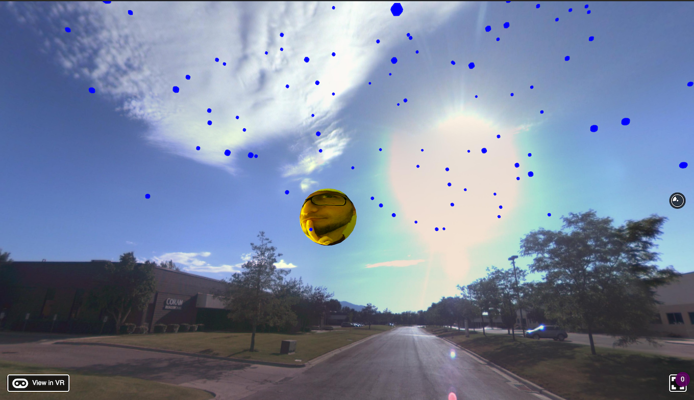

# Sun Schedule

Display an image of the speaker inside the sun at the time of the day at which the talk would take place. To this end, I rendered a moving sun and rain at the time of the day where rain was scheduled.

  

Contribution to the React Europe Hackathon at Mozilla HQ.
My very first VR project.

## Technologies used:

- `React VR`, now [React 360](https://facebook.github.io/react-360/)
- [GraphQL](https://graphql.org/)